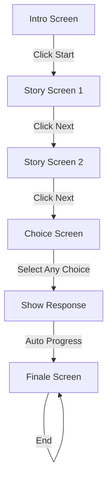

# Design Document

## Overview

The Anniversary Love Game Website is a single-page React application that guides users through a linear narrative experience celebrating a one-year anniversary. The application uses React Router for screen navigation, Framer Motion for animations, and Tailwind CSS for responsive styling. The architecture follows a component-based approach with each major screen as a standalone component.

## Architecture

### Technology Stack

- **Frontend Framework**: React 18+ with TypeScript
- **Build Tool**: Vite
- **Styling**: Tailwind CSS
- **Animations**: Framer Motion
- **Routing**: React Router v6
- **Optional Enhancements**: Lottie for complex animations, canvas-confetti for celebration effects

### Application Structure

```
src/
├── components/
│   ├── IntroScreen.tsx
│   ├── StoryScreen.tsx
│   ├── ChoiceScreen.tsx
│   ├── FinaleScreen.tsx
│   └── shared/
│       ├── TypewriterText.tsx
│       └── AnimatedButton.tsx
├── assets/
│   ├── images/
│   └── animations/
├── data/
│   └── content.ts
├── types/
│   └── index.ts
├── App.tsx
└── main.tsx
```

## Components and Interfaces

### 1. IntroScreen Component

**Purpose**: Landing page that welcomes the user and initiates the experience

**Props**: None (uses content from data file)

**Features**:
- Full-screen layout with centered content
- Typewriter animation for intro text
- Prominent Start button with hover effects
- Optional background image support
- Fade-in entrance animation

**State**: None (stateless component)

### 2. StoryScreen Component

**Purpose**: Displays narrative content with text and media

**Props**:
```typescript
interface StoryScreenProps {
  storyIndex: number;
}
```

**Features**:
- Retrieves story content based on index from content data
- Displays story text with fade-in animation
- Renders associated image/gif
- Next button to progress
- Fade-out transition on navigation

**State**:
- `isVisible`: boolean for controlling fade animations

### 3. ChoiceScreen Component

**Purpose**: Interactive decision point with playful responses

**Props**: None (uses content from data file)

**Features**:
- Displays 2-3 choice buttons
- Modal/popup response on selection
- Animated response (image, text, or animation)
- Automatic progression to finale after response display
- All choices lead to same outcome

**State**:
- `selectedChoice`: number | null
- `showResponse`: boolean

### 4. FinaleScreen Component

**Purpose**: Celebratory conclusion with achievement message

**Props**: None (uses content from data file)

**Features**:
- "Achievement Unlocked" message with animation
- Confetti animation effect
- Optional Lottie animation
- Optional QR code display
- Celebration sound effect trigger (muted by default)

**State**:
- `animationComplete`: boolean

### 5. Shared Components

#### TypewriterText Component

**Props**:
```typescript
interface TypewriterTextProps {
  text: string;
  speed?: number;
  onComplete?: () => void;
}
```

**Features**:
- Character-by-character text reveal
- Configurable typing speed
- Callback on completion

#### AnimatedButton Component

**Props**:
```typescript
interface AnimatedButtonProps {
  children: React.ReactNode;
  onClick: () => void;
  variant?: 'primary' | 'secondary';
}
```

**Features**:
- Hover scale animation
- Ripple effect on click
- Consistent styling across app

## Data Models

### Content Data Structure

```typescript
// src/data/content.ts

export interface IntroContent {
  title: string;
  subtitle: string;
  backgroundImage?: string;
}

export interface StoryContent {
  text: string;
  image: string;
  imageAlt: string;
}

export interface ChoiceOption {
  id: string;
  text: string;
  response: {
    message: string;
    image?: string;
    animation?: string;
  };
}

export interface ChoiceContent {
  prompt: string;
  options: ChoiceOption[];
}

export interface FinaleContent {
  message: string;
  submessage?: string;
  animation?: string;
  qrCode?: string;
}

export interface AppContent {
  intro: IntroContent;
  stories: StoryContent[];
  choice: ChoiceContent;
  finale: FinaleContent;
}

// Default content structure (to be replaced with actual content)
export const content: AppContent = {
  intro: {
    title: "Retry? – Our Story So Far",
    subtitle: "Click start to begin our journey...",
  },
  stories: [
    {
      text: "Story paragraph 1...",
      image: "/images/story1.jpg",
      imageAlt: "First memory",
    },
    {
      text: "Story paragraph 2...",
      image: "/images/story2.jpg",
      imageAlt: "Second memory",
    },
  ],
  choice: {
    prompt: "What would you do?",
    options: [
      {
        id: "meme",
        text: "Send meme",
        response: {
          message: "Classic move! 😂",
          image: "/images/meme-response.gif",
        },
      },
      {
        id: "cry",
        text: "Cry in the shower",
        response: {
          message: "We've all been there... 🚿",
        },
      },
      {
        id: "apologize",
        text: "Apologize",
        response: {
          message: "The mature choice! 💕",
        },
      },
    ],
  },
  finale: {
    message: "1 Year Together – Achievement Unlocked",
    submessage: "Here's to many more adventures! 🎉",
  },
};
```

## Routing Structure

```typescript
// App.tsx routing configuration

const routes = [
  {
    path: "/",
    element: <IntroScreen />,
  },
  {
    path: "/story/1",
    element: <StoryScreen storyIndex={0} />,
  },
  {
    path: "/story/2",
    element: <StoryScreen storyIndex={1} />,
  },
  {
    path: "/choice",
    element: <ChoiceScreen />,
  },
  {
    path: "/finale",
    element: <FinaleScreen />,
  },
];
```

## Styling Approach

### Theme Configuration

```typescript
// tailwind.config.js extensions

theme: {
  extend: {
    colors: {
      romantic: {
        50: '#fdf2f8',
        100: '#fce7f3',
        200: '#fbcfe8',
        300: '#f9a8d4',
        400: '#f472b6',
        500: '#ec4899',
      },
      pastel: {
        pink: '#ffd1dc',
        blue: '#aec6cf',
        lavender: '#e6e6fa',
        peach: '#ffe5b4',
      },
    },
    fontFamily: {
      sans: ['Inter', 'sans-serif'],
      handwriting: ['Dancing Script', 'cursive'],
    },
  },
}
```

### Animation Patterns

**Framer Motion Variants**:

```typescript
// Common animation variants

export const fadeIn = {
  hidden: { opacity: 0 },
  visible: { opacity: 1, transition: { duration: 0.6 } },
};

export const slideUp = {
  hidden: { opacity: 0, y: 50 },
  visible: { opacity: 1, y: 0, transition: { duration: 0.5 } },
};

export const scaleIn = {
  hidden: { opacity: 0, scale: 0.8 },
  visible: { opacity: 1, scale: 1, transition: { duration: 0.4 } },
};

export const pageTransition = {
  initial: { opacity: 0, x: 100 },
  animate: { opacity: 1, x: 0 },
  exit: { opacity: 0, x: -100 },
  transition: { duration: 0.5 },
};
```

## Navigation Flow



## Error Handling

### Missing Content

- If story content is missing, display placeholder text and log error to console
- If images fail to load, show fallback gradient background with alt text
- Gracefully handle missing animations by showing static content

### Navigation Guards

- Prevent direct URL access to later screens (redirect to intro)
- Handle browser back button by disabling or redirecting forward
- Ensure all routes are defined and handle 404 with redirect to intro

### Asset Loading

- Preload critical images during intro screen display
- Show loading spinner for large assets
- Implement lazy loading for non-critical media

## Testing Strategy

### Component Testing

- Test each screen component renders correctly with mock data
- Verify navigation triggers work as expected
- Test animation completion callbacks
- Verify responsive layouts at different breakpoints

### Integration Testing

- Test complete user flow from intro to finale
- Verify all navigation paths work correctly
- Test choice selection and response display
- Ensure animations don't block user interaction

### User Acceptance Testing

- Manual testing of complete experience on mobile and desktop
- Verify emotional impact and pacing of narrative
- Test with actual content and assets
- Gather feedback on animation timing and transitions

## Performance Considerations

- Optimize images (WebP format, appropriate dimensions)
- Lazy load non-critical components
- Minimize bundle size by code splitting routes
- Use CSS transforms for animations (GPU acceleration)
- Preload next screen assets during current screen display

## Deployment

- Build optimized production bundle with Vite
- Deploy to Netlify or Vercel with automatic deployments
- Configure custom domain if desired
- Set up environment variables for any API keys (if QR code generation used)
- Enable HTTPS and configure caching headers
